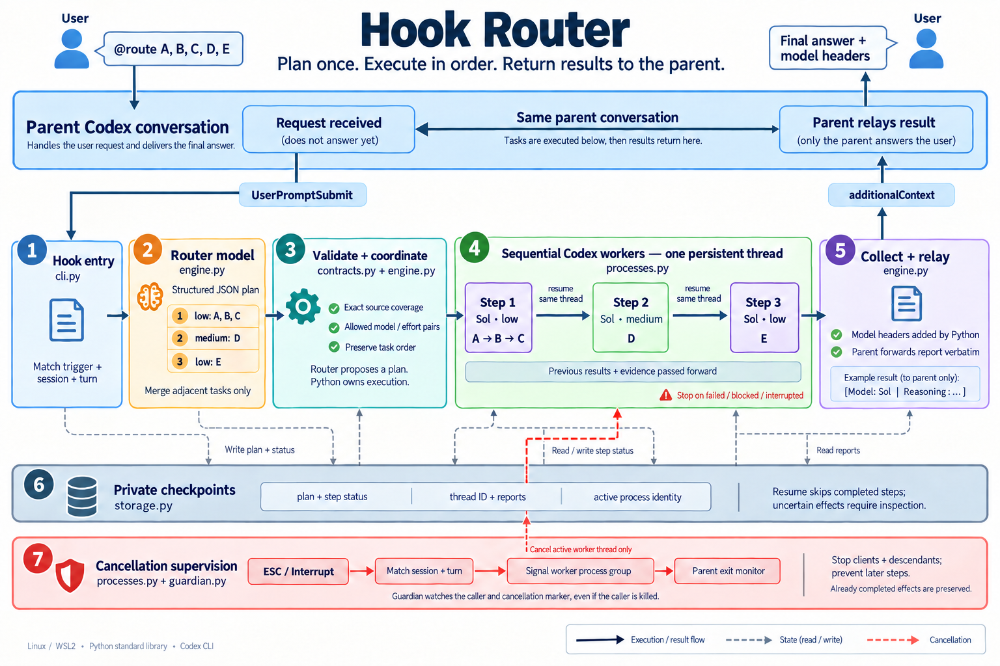

# Hook Router

**Keep your Codex conversation. Delegate selected work to the right models.**

Hook Router is a **Codex plugin** for requests that mix routine work with harder analysis. Select **Route** from the `@` menu, write your request, and submit. A routing model splits the request into ordered steps; Python validates the plan and runs each step through a Codex worker with the assigned model and reasoning effort. The results return to your parent conversation.

```text
Ordinary request → your parent Codex model

@route request   → routing plan → Codex workers, in order → parent reports results
                                  low → medium → low
```

The plugin contains two lifecycle hooks, with **no added skill or MCP server**. It uses Python's standard library and your existing Codex authentication. Configuration and runtime records stay outside the repository. MIT licensed.

[Install](#quick-start) · [Routing rules](#configuration) · [Cost example](#cost-example-and-its-limits) · [LiteLLM comparison](#how-this-compares-with-litellm) · [Architecture](#architecture) · [Verification](#tests-and-verification)

## Why use it?

- **Choose what to delegate.** Ordinary prompts stay with the parent model. Only requests beginning with the routing prefix or plugin mention launch the routing workflow.
- **Assign models by task.** Put your own selection criteria in `profiles[].description`: routine summaries can use one profile, new evidence review another.
- **Run Codex agents.** Workers can read files, call tools, and iterate through `codex exec`. Later steps resume one persistent worker thread for the parent session.
- **Preserve dependencies.** A review runs before the reply based on it, even when the earlier summary and later reply use the same model.
- **Resume interrupted work.** Checkpoints track completed steps; interruption stops the matching local worker processes. Recovery inspects effects before continuing.
- **Avoid a separate gateway deployment.** The package runs locally alongside Codex. It does not require a new model API service.

This is useful for bounded workflows combining extraction, technical review, and follow-up actions. A short one-step question may be faster and cheaper to handle directly. Routing can misclassify a task, and the parent model still consumes usage when delivering the report.

## Cost example and its limits

An [anonymized cost study](cost_comparison.md) applies published model prices to observed token counts from one three-step workflow. It includes repeated context, tool interactions, reasoning output, routing, and parent delivery. Alternative configurations were **repriced, not rerun**.

| Configuration in that example | API-equivalent cost | Reduction vs. Astra-only work baseline |
|---|---:|---:|
| Three substantive stages repriced as Astra; no router or separate relay | $4.392 | Baseline |
| Observed tokens: Astra parent, Sol router and workers | $2.401 | 45.3% |
| Hypothetical Luna parent; original Sol router and workers | $0.791 | 82.0% |
| Hypothetical Luna parent and routine workers; Sol router and analytical worker | $0.480 | 89.1% |

**The 89.1% figure is an illustrative static price reduction, not a measured improvement in quality, speed, or subscription allowance.** Token counts and cache hits are held constant across models. The baseline excludes routing and separate relay overhead; routed rows include both. The study uses rates checked on 2026-10-04 rather than promising current prices.

The default worker profiles remain Sol low / Sol medium / Astra high; this example does not change your configuration or parent model. Validate smaller models on your own tasks before adopting an alternative.

One user request in the study produced **19 model responses**, including 13 worker tool calls. The Astra parent's report delivery alone accounted for about $1.626 of the observed $2.401 equivalent. A large parent context can therefore offset worker savings. Resume preserves history but does not make context processing free.

See [the full calculations, assumptions, and subscription caveats](cost_comparison.md). Plugin registration and Python coordination add no model calls by themselves; the planner, workers, and parent relay do.

## How this compares with LiteLLM

**Codex can use LiteLLM as a model provider and retain its agent loop and session.** Hook Router's distinction is selective delegation and explicit workflow coordination. [LiteLLM's Codex integration](https://docs.litellm.ai/docs/proxy/client_setup/codex_cli)

| Question | Hook Router | Codex connected to LiteLLM |
|---|---|---|
| When does routing apply? | To requests you explicitly delegate with `@route` | To model requests sent through the configured provider; automatic selection is optional |
| What is assigned? | An ordered task group, executed by a Codex worker | A model request arriving at the gateway; session pinning is also available |
| Who sets the criteria? | You configure profiles and descriptions; the planner interprets them | You configure model groups, routing strategies, or Auto Router classifiers and tiers |
| Who manages work? | The coordinator tracks a separate worker thread, step order, checkpoints, and parent relay | Codex manages the agent loop; provider setup alone does not create this parent/worker workflow |
| What is the operational focus? | Local, selective delegation within a Codex workflow | Provider integration, request routing, load balancing, and failure handling |

LiteLLM supports both operational strategies such as cost/load/latency and content-based Auto Router classification. Custom criteria are possible in both systems. Choosing a gateway does not require automatic downgrading of every request. [Routing strategies](https://docs.litellm.ai/docs/routing), [Auto Router](https://docs.litellm.ai/docs/auto_router)

The systems can be combined in principle, but this implementation does not inherit arbitrary custom-provider configuration into workers. Such integration requires explicit provider/authentication support and verification. Read the [detailed comparison and tradeoffs (Korean)](docs/261004_litellm-comparison.md).

> **Platform:** Linux or WSL2, Python 3.9+, and authenticated Codex CLI with `UserPromptSubmit`, `Interrupt`, `--output-schema`, and `exec resume` support. Tested with **Codex 0.160.0**. Native Windows/macOS are not supported by the current `/proc` process supervisor.

## Quick start

```bash
git clone https://github.com/InfolabAI/hook_router.git
cd hook_router
codex login
python3 router.py --init-config  # first installation only; keep an existing config
```

Edit `~/.config/codex-hook-router/config.json` to select **model IDs available to your account**. The included example uses Sol low / Sol medium / Astra high; these are examples, not an availability guarantee. You can use one model with different reasoning efforts, or replace all profiles.

```bash
python3 router.py --check
codex plugin marketplace add "$PWD"
codex plugin add route@hook-router
```

If you previously used this checkout's `python3 router.py --install`, run `python3 router.py --uninstall` after installing the plugin to remove the duplicate personal hooks. It preserves your configuration and session history.

Restart Codex, open **`/hooks` and review/trust the plugin's `UserPromptSubmit` and `Interrupt` definitions**. This is a Codex requirement; installation does not bypass hook trust. Type `@route`, select **Route** (Plugin), and append your request. The picker inserts `@Route`; serialized `plugin://route@...` mentions are also recognized. Selection alone does not run anything; submitting the request starts the hook before the parent model.

The repository root is the plugin package: `.codex-plugin/plugin.json` supplies its identity and menu description, `hooks/hooks.json` registers both lifecycle events using `${PLUGIN_ROOT}`, and `.agents/plugins/marketplace.json` makes this checkout installable. Installed code is cached by Codex; reinstall after updating the source. The personal config and state remain outside the plugin. The bundled hook timeout is 960 seconds (Interrupt: 3); keep `total_timeout` below that or update the hook definition and review trust again.

For a standalone installation without a plugin menu entry, use `python3 router.py --install` instead of the plugin commands. Use only one registration method at a time.

Then, in any Codex workspace:

```text
@route Summarize the supplied notes, extract the action items, review the proposed experiment, then draft a short reply. Do not send it.
```

The parent receives an instruction to forward the report verbatim, with headers such as:

```text
[Model: gpt-6.1-sol | Reasoning: low]

Step 1/3: completed
...
```

The parent relay is an instruction to the parent model, not a deterministic output renderer. Execution order, validation, and checkpointing are enforced by Python.

## Architecture



*Generated with GPT Image. The [full generation prompt](docs/architecture-image-prompt.md) is included. The module descriptions and source below are authoritative.*

### Follow the numbered modules

| # | Diagram module | Source | Responsibility |
|---|---|---|---|
| 1 | Hook entry | [`cli.py`](hook_router/cli.py), [`config.py`](hook_router/config.py) | Match `@route`, load the configured profiles, associate the request with its parent session and turn. Ordinary prompts pass through without launching models. |
| 2 | Router model | [`engine.py: router_prompt`](hook_router/engine.py) | Ask a small/cheap model for a **structured plan only**. It must not perform the requested tasks. Profiles are configurable, not inferred from pricing. |
| 3 | Validate + coordinate | [`contracts.py`](hook_router/contracts.py), [`engine.py`](hook_router/engine.py) | Validate supported model/effort pairs and exact source coverage, merge adjacent equal profiles, and run the plan in its original order. |
| 4 | Sequential workers | [`processes.py`](hook_router/processes.py) | Run `codex exec` for each group, switching model/effort while resuming **one persistent worker thread per parent session**. Pass preceding results and evidence forward. |
| 5 | Collect + relay | [`engine.py: report / relay`](hook_router/engine.py) | Add model headers in Python and return `hookSpecificOutput.additionalContext`. **The parent assistant forwards the report**; workers do not answer the user directly. |
| 6 | Private checkpoints | [`storage.py`](hook_router/storage.py), [`engine.py`](hook_router/engine.py) | Atomic plan/state files, per-session lock, thread ID, step results, and private report files. Completed steps are skipped on resume. |
| 7 | Cancellation supervision | [`processes.py`](hook_router/processes.py), [`guardian.py`](hook_router/guardian.py) | Match an `Interrupt` to its session/turn, terminate the active process group, and watch for caller death even when normal cleanup cannot run. |

[`router.py`](router.py) is the portable entrypoint. [`install.py`](hook_router/install.py) merges the two hook definitions into your hooks file while preserving unrelated hooks and backing up the previous file.

### Why consecutive grouping matters

For `A → B → C → D → E`, suppose A/B/C/E use the routine profile and D needs deeper analysis:

```json
{
  "steps": [
    {"model": "gpt-6.1-sol", "effort": "low", "commands": ["A, ", "B, ", "C, "]},
    {"model": "gpt-6.1-sol", "effort": "medium", "commands": ["D, "]},
    {"model": "gpt-6.1-sol", "effort": "low", "commands": ["E"]}
  ]
}
```

**E stays after D.** The router cannot group all low-effort tasks together if that changes the order. Concatenating the command fragments must reproduce the original request *exactly*, including whitespace and separators. Semantic routing is still an AI judgment: exact coverage does not prove the chosen model or task interpretation is correct.

## Configuration

Start with [`examples/config.json`](examples/config.json). No package installation or API SDK is required.

| Setting | Meaning |
|---|---|
| `trigger` | Prefix to intercept, default `@route`. |
| `router` | Model and effort for the planner. |
| `profiles` | Allowed worker model/effort pairs, names, and descriptions explaining when to use each. |
| `instructions` | Workflow-specific rules given to every worker. Add your own skill/document paths here if needed. |
| `sandbox` | `read-only` by default; `workspace-write` enables normal workspace edits. |
| `network_access` | Default `false`. For network-enabled workers, use `workspace-write` and set this to `true`. |
| `writable_roots` | Optional extra writable directories. The workspace from the hook event is the worker's working directory. |
| `state_dir` | Private state root; default `~/.local/share/codex-hook-router`. |
| `total_timeout` | Total planning + execution budget, default 900 seconds. |
| `router_timeout` / `worker_timeout` | Per-call caps, also bounded by remaining total time. |

For file editing and authorized network operations:

```json
{
  "sandbox": "workspace-write",
  "network_access": true,
  "writable_roots": [],
  "instructions": "Follow this workspace's AGENTS.md. Make only the changes explicitly requested. Verify results and report evidence."
}
```

Merge those keys into your config; keep your profiles and other settings. Worker authorization still comes from the user. Enabling network access is not permission to send messages or modify external systems.

The worker uses `--ignore-user-config`, disables hooks/apps/nested agents, and reuses your **Codex login files**. It does not inherit arbitrary MCP/app configuration. Secret-looking environment variables (including API keys) are removed. Environment-only API authentication is therefore not supported; use `codex login` or supported file-backed Codex authentication.

A new parent Codex session gets a new worker thread. Later routed requests in the same parent session resume that worker thread. The parent's entire conversation is **not** automatically copied: give important context in the routed request or accessible workspace files. Workers retain their own conversation and receive the previous step results explicitly.

### Your model-selection guide

`profiles[].description` is sent to the **router** on every routed request. `instructions` is sent to **workers** and does not serve as the router's model-selection guide.

For example, customize the routine profile in your existing `profiles` list:

```json
{
  "name": "routine",
  "model": "gpt-6.1-sol",
  "effort": "low",
  "description": "Summarize inboxes, extract confirmed task fields, and draft replies from an already completed review. New technical validation belongs to the analysis profile."
}
```

Describe new evidence review in the analysis profile and difficult design or conflicting evidence in the complex profile. A request can also explicitly ask for a supported model and effort. Python enforces allowed pairs and source order; it does **not** independently prove that the planner honored every natural-language model preference or classified difficulty correctly.

The parent's model is separate from these settings. The plugin does not change it. Workers need relevant context in the request or accessible files; a short instruction referring only to the parent's earlier discussion may be insufficient.

### Resume configuration pitfall

All `-c` overrides are placed **after `resume <thread_id>`** when resuming. Splitting overrides before and after `resume` caused network access to revert to disabled in the tested CLI. The regression test preserves this ordering without disabling the sandbox.

## Failure, interruption, and recovery

Worker results have `status`, `report_markdown`, and `evidence`. A successful process exit alone is insufficient: Python validates the result contract and requires `completed` before advancing.

- Invalid router output: one contract retry, then stop without executing workers.
- Failed, blocked, malformed, or timed-out worker: stop all later steps and preserve the checkpoint.
- **ESC / Interrupt:** the installed `Interrupt` handler targets only the matching session/turn and terminates the active guardian/Codex process group. The guardian also watches caller identity and the cancellation marker.
- **Caller killed:** the guardian detects its disappearance and terminates the worker group. Linux PID start times prevent stale records from targeting a reused PID.
- Completed effects are not undone. Local process cancellation is prompt, but provider-side generation/billing may take time to stop. Arbitrarily detached programs that create new sessions are outside process-group supervision.

```text
@route --resume
@route --cancel-plan
```

`--resume` skips completed steps and instructs the interrupted worker to inspect actual effects before continuing. If the worker thread ID was lost, the coordinator refuses to invent a replacement session. `--cancel-plan` cancels only the remaining plan and preserves existing effects/history.

**This is not an exactly-once transaction system.** A remote send can succeed before its receipt is recorded. Use domain-specific idempotency keys and effect verification for messaging, payments, deployments, or other external writes. The generic router cannot prove those effects itself.

## State and privacy

Runtime data stays outside the repository by default:

```text
~/.local/share/codex-hook-router/
  sessions/<hashed-parent-id>/
    lock
    active.json             # current turn + PID identities; removed on normal exit
    state.json              # persistent thread + pending run
    run-*/
      request.txt
      route.json
      plan.json
      router-*/
      step-*/
      report.md
  reports/relay-*/report.md  # complete report for the parent to read
```

Private files use mode 600; created runtime directories use 700. Requests, prompts, results, and persistent Codex worker history can contain sensitive data. They are not deleted automatically. Do not commit them or put `state_dir` in a public checkout. Raw worker event traces are not saved by this wrapper; Codex maintains its own non-ephemeral worker history.

Short reports are included in additional context; long reports are passed by private file path. The parent is told to read the complete file and never rerun the original work. Infrastructure failures fail closed rather than accidentally letting the parent duplicate partially completed work.

The repository includes no credentials or live datasets. Publishing this source does not publish your local config or runtime state. No claim is made that the sandbox blocks access to every readable private file: configure your workspace and task scope appropriately.

## Tests and verification

**Verified:** 12 offline tests, a live synthetic low → medium → low workflow in one persistent worker thread, plugin installation, and the actual `@route` mention picker. See [the verification record](docs/verification.md).

**Limits:** fake-process tests validate coordination and local cleanup; they do not establish task accuracy or provider-side billing cancellation. Parent relay wording depends on the model, and interactive execution requires trusted hooks. The cost study is a separate static calculation, not an execution benchmark.


```bash
python3 -m unittest discover -s tests -v
```

Offline tests use fake Codex processes. They cover source preservation, sequential grouping, persistent-thread handoff, failure/resume, schema validation, networking override placement, installer preservation, parent relay, interrupt cleanup, and cleanup after a forcibly killed caller. No account credentials, student data, external messages, or paid model calls are required.

For a live smoke test after installation, use a synthetic task with no side effects:

```text
@route Use only this fixture; do not access files, network, or external systems. Use routine for A: list two colors. Use analysis for B: explain why one experimental run cannot establish reproducibility. Use routine for C: summarize B in one sentence.
```

## Update or uninstall

After updating the source checkout, reinstall the cached plugin:

```bash
git pull
codex plugin add route@hook-router
```

Restart Codex and review any changed definitions in `/hooks`. Your personal model-selection config and session state remain separate from the installed package.

For a plugin installation:

```bash
codex plugin remove route@hook-router
```

For the alternative standalone hook installation:

```bash
python3 router.py --uninstall
```

The standalone command removes only this checkout/config command's two personal hook entries, preserving unrelated hooks. It does not uninstall the plugin. `--hooks-file PATH` supports alternate personal hook files. Neither method deletes your external configuration, reports, or worker history; remove those separately only when intended.

## Documentation

- [Cost comparison: measurements, static scenarios, and subscription limits](cost_comparison.md)
- [Hook Router vs. LiteLLM: selection scope and agent sessions (Korean)](docs/261004_litellm-comparison.md)
- [Verification: automated checks, live smoke test, and plugin installation](docs/verification.md)
- [Codex hooks and hook trust](https://learn.chatgpt.com/docs/hooks)
- [Architecture image generation prompt](docs/architecture-image-prompt.md)
- [Module source](hook_router/)

The router uses your Codex authentication and account usage allowance. Planner calls, worker calls, retained worker context, and the parent relay all consume usage. Choosing cheaper workers can reduce cost but is not a fixed subscription-limit multiplier.
